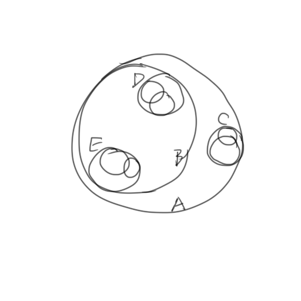
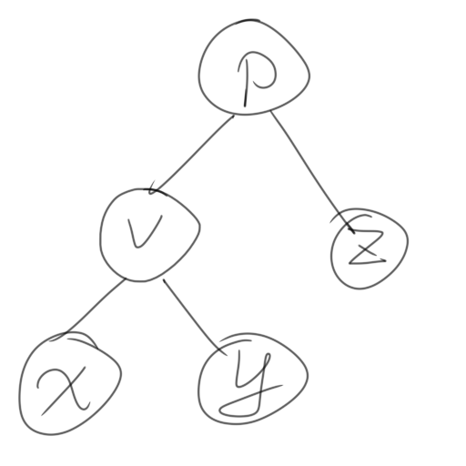
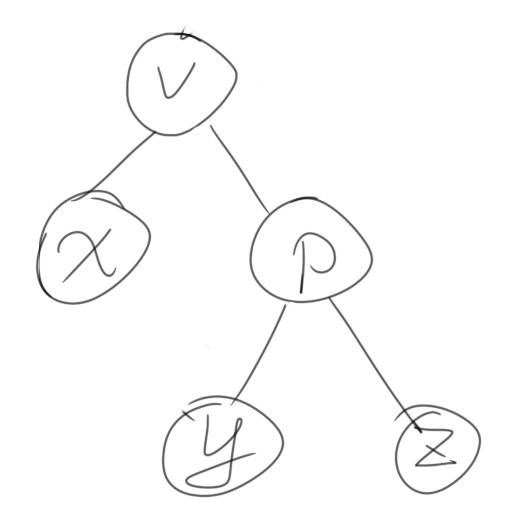
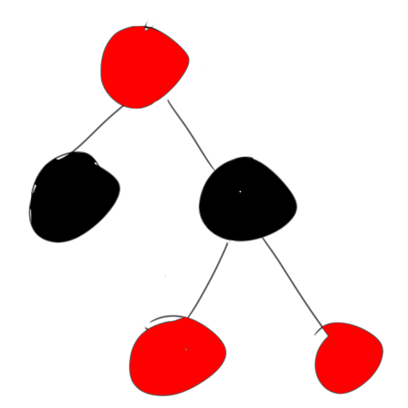

# <center>升华网程序部二面~~道中攻略中~~</center>

~~GH这个屑Preview还是有各种各样的问题啊……~~

---------

## 本周学习计划

行吧，这一周还是主要是完成军训。真没有什么时间拿来充电学习编程方面的内容，当然非要说的话也不是没有计划=_=

+ 9.16 完成军训，听人生相谈，学SAI2基本用法，看校规校纪考试内容
+ 9.17 完成军训，时间有多的话可能看一下逆向工程，看校规校纪考试内容
+ 9.18 完成军训，学SAI2基本用法，看校规校纪考试内容
+ 9.19 完成军训，背校规校纪
+ 9.20 完成军训，背校规校纪
+ 9.21 军训完结，上考场赴死，如果没死的话回来补一下GAUSS消元法的程序实现
+ 9.22 如果放假的话去整银行卡，然后回来可能看看屑站漫画的data段解密的js片段

---------

## git的学习历史？

说实话，git这个东西我最早是在高二的时候才接触的~~珂学火起来那段时间~~。

那个时候打竞赛嘛，也顺便摸鱼熟悉了一下git，不过最早的时候只知道clone别人的仓库然后enjoy。

后来凉了啊，哎

然后就从竞赛走向了开发，这个时候作为一个新手开发者开始重新认识了*Github*

差不多到了高三，别人都在努力复习冲刺了，我却在执着地用着班级电脑学习Github相关的知识，妄图再用自己的双手打出什么成绩来。

所以高三一到，我已经基本掌握了add，commit，push，fetch，pull等等基本git操作，也顺便整出来了现在还挂在我的服务器正常运行的为我的屑站直播账号领银瓜子的[koriru](https://github.com/voidf/koriru "您也可以看到最早的LICENSE是什么时候添加的")，那个项目的README我后来因为各种各样繁忙的事情一直拖着拖着没写完，但那就确实是我那时候的markdown水平~~很丑对吧~~。

我们班级有每个周五轮换宿舍搞一次班会的习惯，高三一整年，我为了那一点点作为程序猿的骄傲，放着便利的PPT不用，独自走上了用HTML做课件的不归路。也是那个时候，自己的[个人博客](https://github.com/voidf/voidf.github.io)也开始在GH上开源。因为要在本地的环境里面跑才能带动整个网页，所以学会了在本地搭设Git仓库实现自给自足不依赖Github。

高三下大约距高考50d时，我又用班级电脑摸出了当时在NGA搞的[碧蓝航线](https://bbs.nga.cn/thread.php?fid=564)萌战这么一个活动的[计票器](https://github.com/voidf/kanmoecounter)，现在看看也许它更像一个框架吧。总之那个时候开始自己用git做小项目开发已经没什么问题了。

**但是本人对git的submodule和多人合作开发这块的folk，push request没有什么概念，希望在以后与各位的交流中学习吧**

~~怎么写这段的时候感觉有点扎心呢~~

~~对了，顺便推荐gitolite这个git仓库搭建工具~~

--------

## markdown？

第一次接触这玩意的时候是在[洛谷](https://www.luogu.org "今天的洛谷logo依然很像女字呢")看题解。

然后受萌娘百科影响，喜欢上了那种文字效果，于是开始学习md。

后来在[博客园](https://www.cnblogs.com/voidf)写博客，也开始在洛谷写题解，运用到了md。

自己的平面设计没学好，GH这里的md也不支持原生HTML，那就只能简单献丑了。

------------
------------

*面试官甲在整理笔试题目*

*v姓水友惊慌地跑进来，一屁股坐在对面的凳子上*

*面试官乙从后面走过来与v姓水友握手，坐下*

>面试官乙：v桑，你好！有什么事我们能帮忙吗？

>v：我要说一件事，你们千万别赶我走。

>面试官乙：我们是面试官，我们不会轻易赶人走。你请说。

>v：我刚才，做错一道题。

>面试官乙：哪道题？

>v：不是什么大题，是关于球的题。

*面试官甲迅速画了一张球状树，给v看。*

[](https://www.wisegeek.com/what-is-a-ball-tree.htm)

>v：不是塞一起的，是分开的。

*面试官甲又画了一张splay树*

[](https://baike.baidu.com/item/伸展树/7003945?fr=aladdin)

>v：它左边是一类，右边是一类。

*面试官甲拿起splay树，zig了一下*



>v：颜色呢？一边是红一边是蓝的。

*面试官甲拿起树，面试官乙拿过来，加了颜色：红黑树。*

[](https://en.wikipedia.org/wiki/Red–black_tree)

>v不耐烦地拨开树：就你们笔试那道题啊！试卷有没有看？就是那道很多人抽奖，抽到红球蓝球的那题，明白吗？

>面试官乙：明白了，你继续说。

>v：那道题我回去跟室友讨论，我说**1：2**他们说**1：1**，我懵啊！这么复杂的题为什么他们都是这个结果？后来他们提醒我我有地方算重复了，蓝球数量多了一倍。我一晚上没睡着一直在想……

*面试官甲低头忍不住笑，一抹脸又严肃起来，又无端生草，又强忍住。

>v：你笑什么？

>面试官甲：我想起高兴的事情。

>v：什么高兴的事情？

>面试官甲：我们部门招够15人了。

*面试官乙也忍不住笑，强忍住。

>v：你又笑什么？

>面试官乙：我们部门也招够15人了。

>v：你们招到的是同15个人？

>面试官甲点头：对对……

*面试官乙笑，两人捂脸笑*

>面试官乙：不是，我们是同一个部门。

>v：我再重申一遍，我有好好考虑那道题，我绝对不是因为粗心什么的。

>面试官甲：好的好的。

*两人又忍不住吃吃笑。v姓水友急得拍桌*

>面试官乙：我们言归正传。那个，你刚才说的那道题，很难吗？

>v：它不是难不难的问题。它真的是那种，那种很耐人寻味的那种……好像可以用数列解，又好像跟概率学和微积分有那么一点关系。遗憾的是我奥数没学好，没能好好想出靠谱的方法……

*面试官又发笑*

>v：你欺人太甚，我忍你很久啦！

>面试官甲：我们部门人够了。

>v：你明明在笑我，你都没停过！

>面试官甲：v桑，我们受过严格的训练，无论多好笑，我们都不会笑。**除非忍不住。**

>面试官乙：不如这样，v桑，你先回去等消息，我们升华网络部会认真考虑你的入部申请，你一旦被录取，我们第一时间通知你。

>v：行，你们赶紧处理，好吗？我很强的，多想想我的能力能干什么。

*v赶紧收拾东西，一出门就听见两面试官大笑，v站住。*

*房间里是大草原*

*v回头推门进去，却看见两面试官一脸正经地站在桌子前。*

>面试官甲：v桑，你有什么要补充吗？

*v关上门离开，两面试官又开始生草，门被v推开，两面试官又一脸正气。*

>面试官乙：v桑？

*v甩门出去*

```
//剧本参考
//https://www.docin.com/p-2040439559.html
```

-----------
